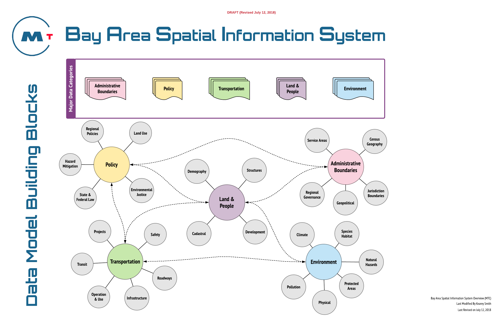
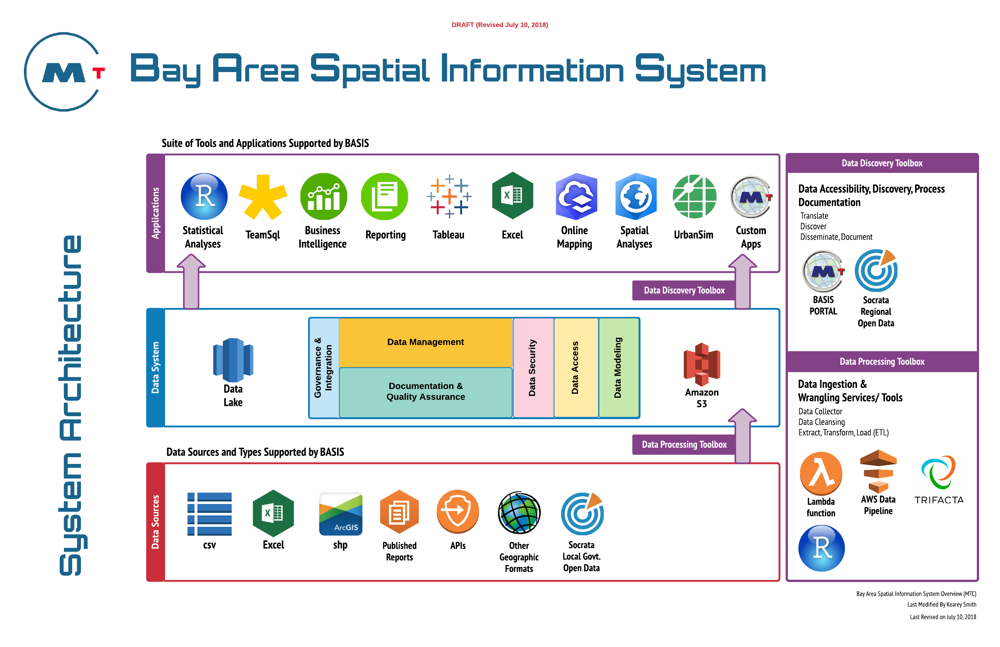
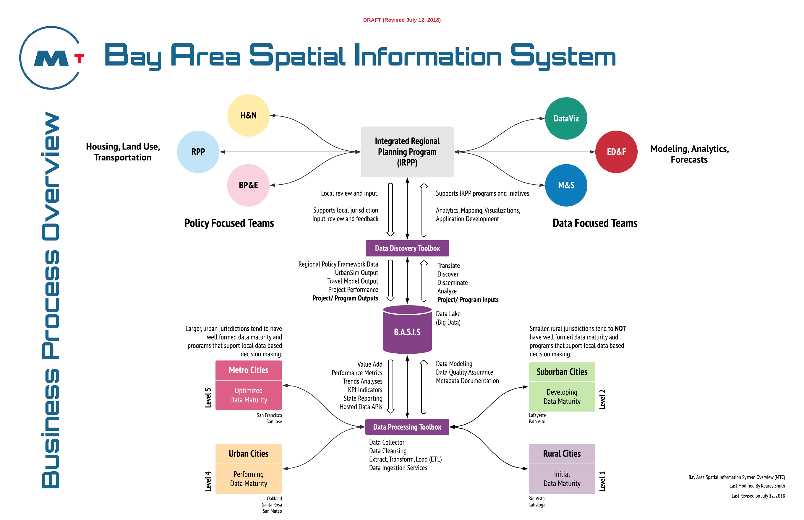
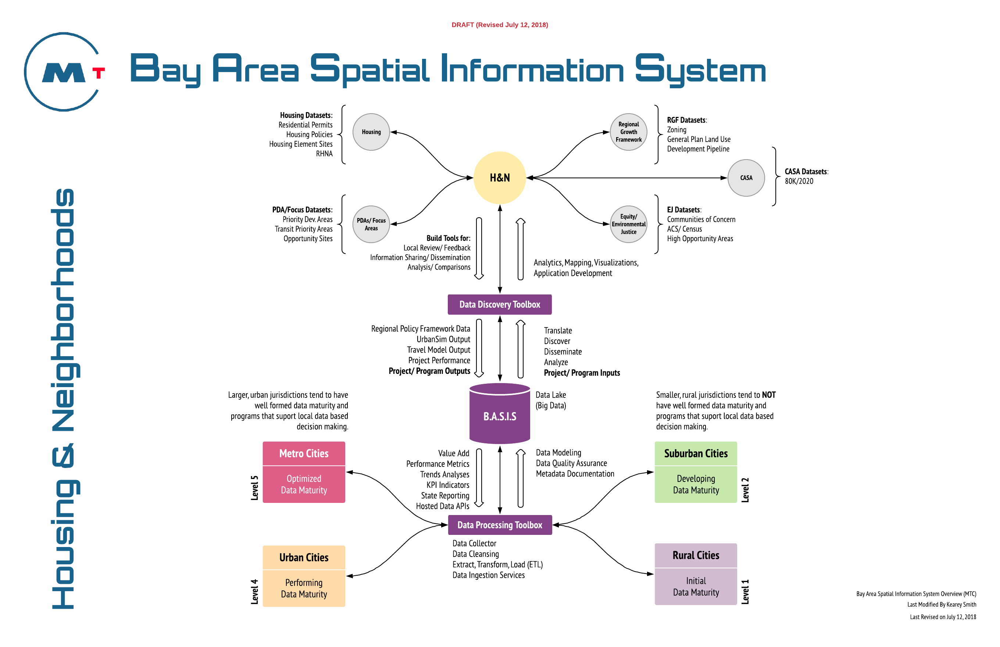

-- Draft --
# Bay Area Spatial Information System (B A S I S)

The Bay Area Spatial Information System (B.A.S.I.S) is a new Open Data Initiative operated by the Association of Bay Area Governments (ABAG) and Metropolitan Transportation Commission (MTC).  Managed by the Data and Visualization Team, a unit within the Integrated Regional Planning Program (IRPP), this system will bring key regional datasets onto an industry standard open-data platform where users internal and external to MTC/ABAG can download it, or access it via API for analysis and modeling.  B.A.S.I.S represents an evolution of past efforts, such as the Local Policy Development Survey (2005), that sought to collect data from local jurisdictions for use in regional forecasts, and long range planning activities for the nine county San Francisco Bay Area region.

Many of these key regional datasets are sourced from local jurisdictions and include data such as Land Use, Zoning, Residential Permitting, and a host of related datasets that describe the development pipeline activity for Bay Area Jurisdictions, all of which is directly related to Plan Bay Area, and support several significant programs wihtin the IRPP.   

Typical datasets that will be targeted for collecting include parcel and policy data used by UrbanSim for land use modeling, as well as housing data such as residential permits, and housing policies. Over time B.A.S.I.S will steadily add more datasets relevant to Regional Transportation and Land Use Planning for the San Francisco Bay Area Region. 

A key component of B.A.S.I.S will include a robust Review and Feedback System that will collect invaluable feedback from local jurisdictions, key regional stakeholders and staff within ABAG/ MTC.

B.A.S.I.S will present the data for review by local jurisdictions in an inventory format that allows local jurisdictions to select a location and retrieve a summary of the data available at that location.  The summary will be associated with a count of parcels that contain any one or more of the landuse, transportation or development characteristics that we track as part of Housing Development Tracking, Transportation and Land Use Modeling (UrbanSim).

Finally, B.A.S.I.S will act as the skeletal and nervous system of the IRPP Database Framework.  The DataViz team will conform all data collected and used for policy development and analytical purposes throughout the IRPP and the other Policy and Operation units of ABAG/MTC and BATA.

## B A S I S Components

## Data Governance

### Key Roles & Responsibilities

### Data Management

### Documentation and Quality Assurance

### Data Security & Accessibility

## Data Categories  

Major Category | Subcategories  
------------   | -------------  
Transportation | Projects, Roadways, Infrastructure, Transit, Operation and Use  
Land & People | Demography, Land Use, Development, Cadastral     
Administrative Boundaries | City/County Boundaries, Census Boundaries, Geopolitical Boundaries  
Environment | Species Habitat, Protected Areas, Physical, Pollution, Climate 
Policy | Growth Management, State & Federal Law, Regional Policies, Environmental Justice    

### Conceptual Data Model  

Figure 1. Data Model Building Blocks
  

## System Architecture  

Figure 2. System Architecture
  

## Business Process

Figure 3. Business Process Overview
  

Figure 4. Business Process Overview (Housing & Neighborhoods Example)
  

## Data Tools  

## Website  
Alpha Release:[http://basis.bayareametro.gov] (Release 0.1g July 25, 2018). 
Beta Release: Planned for August 31, 2018

